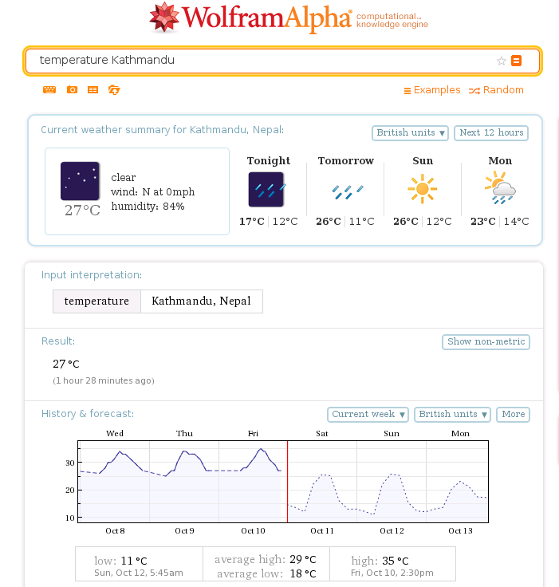
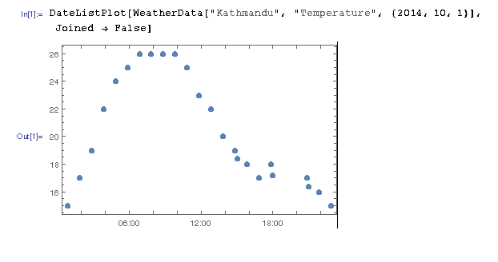
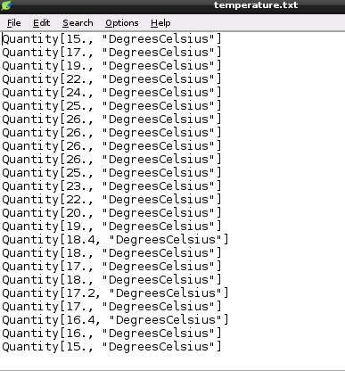

# Worksheet
## Step 1: Find some weather data

We’re going to download some weather data, and turn it into sound. There are many online sources of weather data, but one is built into the Raspbian software—Mathematica. We can get an idea of the type of data available from Mathematica by querying the Wolfram Alpha website (this is from the same company, Wolfram which makes Mathematica).

1. Launch the Epiphany web browser and navigate to [http://www.wolframalpha.com/](http://www.wolframalpha.com/). This allows you to type in queries and get data answers—like a search engine for live data. 
1. Try a query to find temperatures in a given location (substitute your favourite town/city)

    `temperature Kathmandu`
    
    You will see a result such as:
    
    

    …so, if we could get the temperature datapoints which are plotted on the graph into Sonic Pi, we could play notes corresponding to them. Mathematica has access to many datasets, including these weather ones, so the next step is to load it.
    
## Step 2: Look at weather data from Mathematica

1. Quit Epiphany—Mathematica needs all the memory it can get!
2. Launch Mathematica from the desktop icon or by clicking on the Main Menu, then Education, then Mathematica. (We’ll abbreviate menu choices as _Main menu>Education>Mathematica_ from now on). It will take a little while to load; you can see its progress from messages displayed over the image.
    Mathematica is a huge and complex system, but it has excellent documentation, which we can use to see how to access weather information. We’ll use a function called `WeatherData`.
    
    >WeatherData   (Built-in Mathematica Symbol)
WeatherData[loc, " property"] gives the most recent measurement for the specified weather property at the location corresponding to loc. WeatherData[loc, " property", date] ...

    >[Mathematica documentation centre](http://reference.wolfram.com/documentation-search.html?query=weatherdata)
    
The format of the weather function is

```
WeatherData["<name of place>", "<property to get>", {<year>,<month>,<day>}]
```
 …where the parts in angle brackets get replaced with the desired values, 
 On starting, Mathematica will open a ‘notebook’ window. A useful way to check the data we will use is to plot it as a graph. If you click in the notebook and type the command
 
```
 	DateListPlot[WeatherData["Kathmandu", "Temperature", {2014, 10, 1}],  Joined -> False]
```
 	
then hold SHIFT and press ENTER with the cursor on the same line as your input (which tells Mathematica to process it). It will start processing and display your input as `In[1]:=…`. This will take a _long, long_ time the first time you run a query, while Mathematica downloads data sources—maybe 10 minutes or so. Now is the time to go and make a cup of tea…

Finally, you should see a result like this:



Each point on the graph corresponds to a temperature in °C during a day. 

## Step 3: Save the weather data in a file

To get the data into Sonic Pi, the easiest way is to write it into a text file, which Sonic Pi can then read for playing. To do this execute

```
Export["temperature.txt", WeatherData["Kathmandu", "Temperature", {2014, 10, 1}]["Values"]]
```

This will create a file called `temperature.txt`. Take a look at it by opening _Main menu>Accessories>Leafpad_ and viewing (_File>Open_) the `.txt` file. You’ll see formatted data



which shows the temperatures as Mathematica `Quantity` values (these have both a _size_ and a _unit_ part). We can now use Sonic Pi to ‘play’ the temperatures we’ve collected by extracting the temperature value from each `Quantity`.

## Step 4: Hear the sound (finally!)

1. Quit Mathematica
2. Open the file `workspace.txt` in the Leafpad editor
3. _Edit>Select_ all the text, and _Edit>Copy_
4. Open Sonic Pi (_Main menu>Education>Sonic Pi_), select an unused workspace from the tabs at the bottom of the window then paste in the text you just copied.

Have a look at the code…
    
```ruby
# Listen to the weather

# define some utility functions
# quantity_to_temp(quantity)
# return the temperature value from a Quantity string 
def quantity_to_temp(quantity)
  return quantity.sub('Quantity[', '').split('.')[0]
end

# scale(t)
# multiply t by a scaling factor to get a playable note
def scale(t)
  scaling_factor = 3
  return t.to_i * scaling_factor
end

# now play the weather!
use_synth :tri
File.open('/home/pi/temperature.txt') do |file|
  file.each_line {
    |line|
    puts ("Temp = #{line}")    
    play scale(quantity_to_temp(line))
    sleep 0.5
  }
end
```

At the top there are definitions of two utility functions, whose purpose is to turn the output from Mathematica into note which Sonic Pi can play. 

Firstly `quantity_to_temp(quantity)` takes one of the lines from the `temperature.txt` file and does some string manipulation to return a string with just the temperature number in it. (It does this in two stages; firstly removing all the text up to the temp, and then discarding everything after it. Look at Ruby’s [documentation](http://www.ruby-doc.org/core-2.1.3/String.html) to see the String functions used).

Next `scale(t)` is important, so that we can actually hear the note Sonic Pi plays (good values for `play` are between 30 and 120). You need to multiply the temp. by a scaling factor, whose value depends on the place where your temperatures are from. (The range in this particular day in Kathmandu was 15-26 °C.) So, a good value in this case for the variable `scaling_factor` is _3_, giving us notes from 45 to 78. You may have to adjust `scaling_factor` for your choice of location.

The last part of the workspace does the actual playing. Because Sonic Pi has many facilities available from its underlying Ruby language, we can use them to open our temperature file and then iterate over each line of the file, showing the `Quantity` text in the Sonic Pi’s log window, and then playing the scaled note.

(If you’d like to read an entertaining online guide to Ruby, try [Why's (Poignant) Guide to Ruby](http://mislav.uniqpath.com/poignant-guide/). Or for an excellent, more conventional alternative, [Programming Ruby: The Pragmatic Programmer's Guide](http://ruby-doc.com/docs/ProgrammingRuby/)).

Finally, press Sonic Pi’s _Run_ button and listen to the results of this not inconsiderable effort on your part. At the risk of annoying your neighbours/pets, you might want to experiment with different values of `scaling_factor` and `sleep`. 

## Next steps

This is just a brief, prosaic introduction to sonification with Sonic Pi and Mathematica. There are an infinite variety of data sources suitable for treatment in this way. With Sonic Pi’s Ruby programmability, you could continuously query external sources and play sounds to interpret them. 

